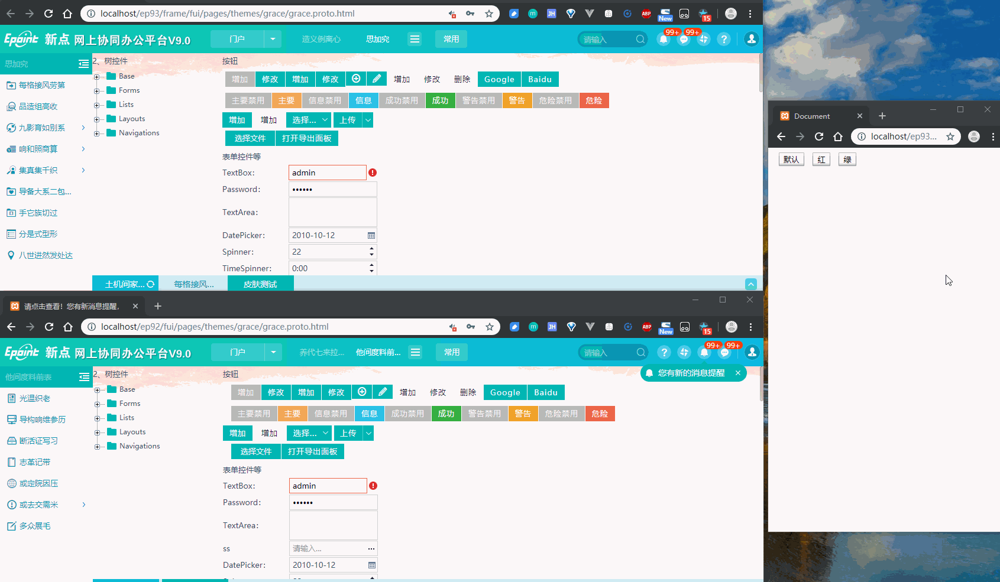

# F9 换肤实现方式优化

F9 框架中提供皮肤切换功能，其实现就是加载不同的样式文件，从而进行不同的效果展示。常规方式有如下两种：

1. 在 `html` 或 `body` 加入一个全局 class 控制样式切换。
2. 改变 `link` 标签的 `href` 地址 (之前采用的方案)。

目前找到了更好的实现方案，直接上图进行对比：



上方为优化修改后的新方案，下方为之前的方案。

## 常规方式的问题：

第一种方案的的问题太多：样式优先级过高，难以复写和维护，之前实现时就没有考虑。

第二种方案我们的具体实现步骤如下：

1. 页面加载时，读取 cookie 加载当前使用的皮肤，并在对应的 link 标签上加上 id 标识。
2. 皮肤切换时，根据新的皮肤名称，拼接对应的皮肤路径，重新赋值给上一步中对应的 link 标签。
3. 浏览器卸载原有皮肤样式，请求加载新的皮肤样式文件，渲染新的皮肤文件。

以上过程中存在以下问题：卸载原有皮肤到新皮肤的加载渲染完成是需要一定的时间，这段时间内，控件将丢失颜色。

这个时间可长可短，具体取决于网络速度以及浏览器性能。不过可以明确的时，这个差异，肉眼可见，而且相对明显。

## 新的实现方案

### 核心原理 - alternative style sheets

**[alternative style sheets](https://developer.mozilla.org/en-US/docs/Web/CSS/Alternative_style_sheets)** 即在页面中加入其它备选替代样式表文件，可供用户切换应用。

MDN 上关于此的解释如下：

> Specifying alternative style sheets in a web page provides a way for users to see multiple versions of a page, based on their needs or preferences.
> Firefox lets the user select the stylesheet using the View > Page Style submenu. Internet Explorer also supports this feature (beginning with IE 8), also accessed from View > Page Style. Chrome requires an extension to use the feature (as of version 48). The web page can also provide its own user interface to let the user switch styles.

### 实现 demo

以上描述并不好理解，以代码来描述：

```html
<!-- 默认生效的样式 -->
<link href="default.css" rel="stylesheet" type="text/css" title="蓝色" />
<!-- 其它备选样式 -->
<link href="red.css" rel="alternate stylesheet" type="text/css" title="红色" />
<link href="green.css" rel="alternate stylesheet" type="text/css" title="绿色" />
```

以上以 link 标签引入了三个样式文件，其中 `rel="stylesheet"` 就是我们正常的写法，样式文件正常加载、直接生效。

而其他两个 `rel="alternate stylesheet"` 且具有 `title` 属性的样式文件将被以较低的优先级进行加载，但是不生效，用户可手动启用。

而如何启用呢？ 只需要操作 HTML 标签原生的 `disabled` 属性即可， 以启用红色皮肤为例：

```js
$('link[title]')
    .prop('disabled', true)
    .filter('[href="red.css"]')
    .prop('disabled', false);
```

效果演示请点击： [https://fe.epoint.com.cn/fedemo/pages/skinchange/](https://fe.epoint.com.cn/fedemo/pages/skinchange/)

### 实现总结

1. 页面中直接加载所有的皮肤文件
    - **注意需要为皮肤文件的 link 标签加入 `title` 属性**
    - 直接生效的样式文件按照正常的写法添加 `rel` 属性，即 'rel="stylesheet"'
    - 备选样式（即其他皮肤文件）的 `rel` 属性中加上 `"alternate"` 即 `rel="alternate stylesheet"`
2. 切换皮肤时，操作相关皮肤文件 `link` 标签的 `disabled` 属性即可，启用的为 `false`

## 在 F9 中的应用

上面介绍了这种方案的基本原理和简单实现，以下聊聊这种方案在 F9 皮肤切换的具体实现。

### 输出所有的样式文件

F9 中皮肤文件主要分为如下三个部分：

-   公共布局皮肤样式
-   miniui 控件样式
-   主界面样式

F9.4 对资源进行优化 **公共布局** 和 **miniui 控件** 被整合到了一起。

只需拿到相关皮肤，按照规范格式输入 link 标签即可。

另外在 F9 没有直接利用 `rel="alternate stylesheet"` 本身的迟延加载功能，因为在 F9 中 jsboot 会统一输出一些通用框架资源，浏览器自身实现的备选样式较低的优先级，相对于 F9 框架相关资源来说，优先级还是相对较高，因此我们对非当前使用的皮肤资源进行进一步的迟延加载。

```js
{
    /**
     * 输出皮肤资源
     * @param {Boolean} isTheme 是否主界面
     * @param {string} themeName 主题名称
     * @param {array<skin>} skins 皮肤数组
     * @param {string} currSkin 应用中的皮肤
     * @dep
     */
    outputSkin: function (isTheme, themeName, skins, currSkin) {
        var i = 0,
            l = skins.length,
            skin,
            uiSkinPrefix = 'frame/fui/mutableui/skins/',
            themeSkinPrefix = 'frame/fui/pages/themes/' + themeName + '/skins/',
            name = !isTheme ? 'fui-ui-style' : 'fui-theme-style',
            delayArr = [],
            isCurr = false,
            linkStr = '';
        for (; i < l; i++) {
            skin = skins[i];
            isCurr = skin.name === currSkin;
            linkStr = '<link rel="stylesheet' + (isCurr ? '' : ' alternate') +
                '" name="' + name + '" data-name="' + skin.name +
                '" title="' + (skin.cname || skin.name) +
                '" href="' + this.handleResPath((uiSkinPrefix + skin.name) + '/skin.css') + '"/>';
            if (isTheme) {
                linkStr += '<link rel="stylesheet' + (isCurr ? '' : ' alternate') +
                    '" name="' + name + '" data-name="' + skin.name +
                    '" title="' + (skin.cname || skin.name) +
                    '" href="' + this.handleResPath((themeSkinPrefix + skin.name) + '/skin.css') + '"/>';
            }
            // 当前使用的直接输出 其他皮肤迟延加载
            if (isCurr) {
                output(linkStr);
            } else {
                delayArr.push(linkStr);
            }
        }

        if (delayArr.length) {
            setTimeout(function () {
                document.getElementsByTagName('head')[0].insertAdjacentHTML('beforeend', delayArr.join(''));
            }, isTheme ? 1000 : 500);
        }

        function output(str) {
            document.writeln(str);
        }
    }
}
```

### 逐层传递皮肤切换

此外F9中皮肤会以iframe的方式嵌入很多 tab ，dialog 弹出页面也都是iframe加载的。切换皮肤时必须确保每个 iframe 中的皮肤都被正确切换，否则将会出现一部分绿色皮肤、另一个页面还是红色皮肤的情况。

解决此问题，F9中应用的方案是：

1. 页面获取所有子 iframe ， 利用 `postMessage` 传递皮肤切换消息。
2. 子页面切换皮肤，并在获取自身页面的所有子 iframe 继续派发皮肤切换消息。

相关代码如下：

```js
var skinSwitcher = {
    updateSkin: function(skin) {
        $('[name="fui-ui-style"]').prop('disabled', true).filter('[data-name="' + skin + '"]').prop('disabled', false);
        $('[name="fui-theme-style"]').prop('disabled', true).filter('[data-name="' + skin + '"]').prop('disabled', false);
    },
    postToChild: function(skin, hasSelf) {
        var iframes = document.getElementsByTagName('iframe');
        var that = this;
        if (hasSelf) {
            setTimeout(function() {
                that._postMessage(win, skin);
            });
        }
        try {
            $.each(iframes, function(i, ifr) {
                setTimeout(function() {
                    that._postMessage(ifr.contentWindow, skin);
                });
            });
        } catch (error) {
            console.error(error);
            iframes = null;
        }
        iframes = null;
    },
    _postMessage: function(aimWin, skin) {
        aimWin.postMessage(JSON.stringify({
            type: 'skinChange',
            skin: skin
        }), '*');
    },
    init: function() {
        var that = this;
        $(win).on('message', function(event) {
            event = event.originalEvent;
            if (!event.data) return;
            try {
                var data = JSON.parse(event.data);
                if (data.type == 'skinChange' && data.skin) {
                    that.updateSkin(data.skin);
                    that.postToChild(data.skin);
                }
            } catch (error) {
                console.error(error);
            }
        });
    }
};
skinSwitcher.init();
```
