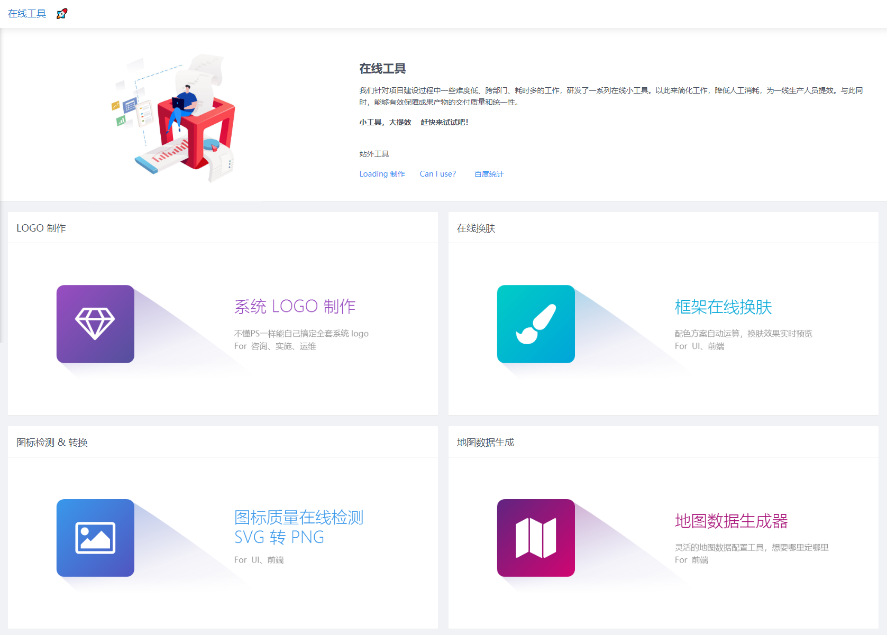

# 中台新增F9在线换肤工具

为了方便开发工作、提高开发效率，近期我们在 [产品设计中台](https://designplatform.epoint.com.cn/epoint-web/designstage/designplatform/dist/) 新增了一系列开发小工具：

访问路径：[**OA首页 :arrow_right: 门户 :arrow_right: 产品设计中台 :arrow_right: 在线工具**](https://designplatform.epoint.com.cn/epoint-web/designstage/designplatform/dist/#/design/multiple/5f16c641-c58d-4b50-b894-a9999add281a)

此次的主角则是 F9 在线换肤工具，第一排第二个。

访问路径：**OA首页 :arrow_right: 门户 :arrow_right: 产品设计中台 :arrow_right: 在线工具 :arrow_right: 框架在线换肤** [点此直达](https://designplatform.epoint.com.cn/epoint-web/designstage/designplatform/dist/#/design/multiple/5f16c641-c58d-4b50-b894-a9999add281a)

## 使用介绍

直接调整各个色板的颜色，即可在右侧实时看到对应的效果。

生成皮肤文件基于9个色值， 不过大多数情况下，仅用配置一个主色和对应的两个辅色即可。

颜色的具体规则可参考[控件换肤配色规则](https://docs.qq.com/sheet/DSnVyZmhkTHluYUJN?opendocxfrom=admin&tab=BB08J2)

:::tip tips
文本框聚焦边框默认使用主色调，直接和主色调进行联动，但当主色调为红色时，请将其配置为其他颜色，以避免聚焦的红色和验证失败的红色存在冲突和歧义。
:::

## 功能

::: tip  简单好用
简单一句话，那就是： 选几个颜色，即可直接生成一套皮肤。
:::

- 直接点击更改颜色，工具将立即进行编译，并在右侧提供实时预览。
- 可随时查看和下载编译好的皮肤文件。
- 同时还提供框架已有的预设皮肤颜色配置。
- 你还可以将你的调整存为本地预设，之后选择此预设并在此基础上继续调整。

:::warning
- 目前预览效果仅支持 **F9.4**
- 在线换肤预览基于对框架和miniui相关图标全部有图片改为字体图标的，无法不升级直接使用
- 其他版本的支持需等待在此版本上完成字体图标改造方可使用
:::