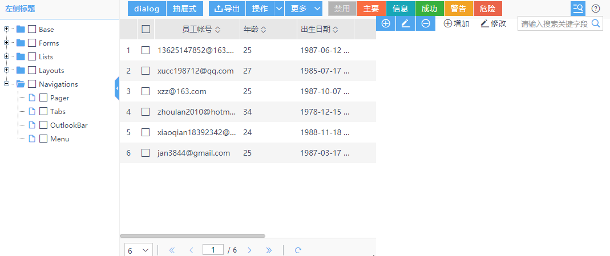
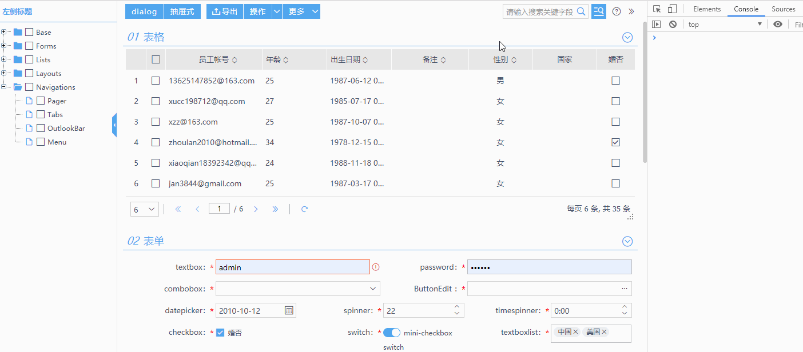

# Toolbar Overflow 支持

业务逻辑复杂，功能按钮太多，一不小心就在工具栏上放了太多的按钮，于是悲剧就发生了，比如：

工具栏按钮折行，直接导致主体区域中的的表格宽度变小。

如上的情况在项目中可能并不少见，而其一旦出现，对用户来说，使用体验上是非常糟糕的。

虽然出现如上的情况，本身有页面按钮规划放置不合理的问题，但其出现频率较高，因此框架在最新版本中新增了 ToolbarOverflow 的支持，即当可视宽度不足以展示工具栏中的内容时，会自动将溢出内容移动，将自动出现扩展按钮：效果展示如下:

<Vssue title="toolbar overflow 支持" />