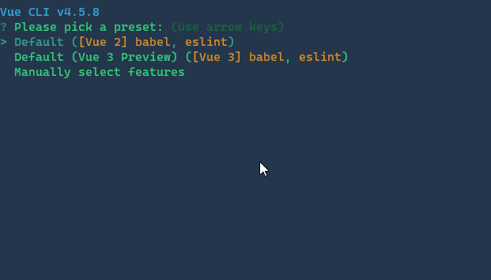
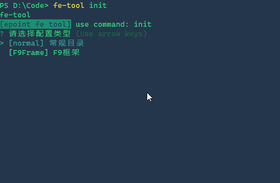
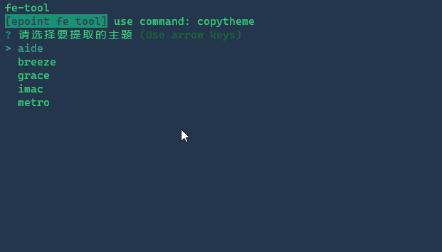
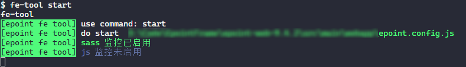
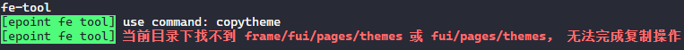
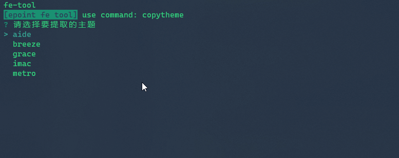
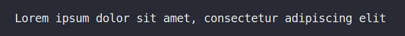
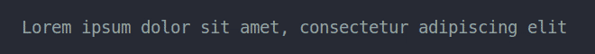
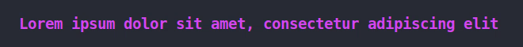
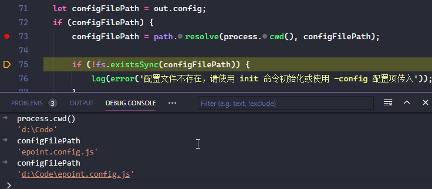

# 如何写一个命令行工具

接上文 [写了一个自己用的命令行工具](https://oa.epoint.com.cn/EpointCommunity/EpointCommunity/Dis/ShowTopic.aspx?TopicID=21414)

本文将简要分析如何使用js实现此工具。

简要回顾此命令行具备的功能：

1. 初始化配置文件（交互式终端）
2. 启动监控（sass 编译， js 压缩， 浏览器自动刷新）
3. 抽取复制主题文件（交互式终端）
4. 编译单个sass文件

## 基本结构

必要结构如下：

```
│───package.json
└───bin
    └───fe-tool
```

**package.json** 

package 文件 可以 `npm init` 直接生成, 内部字段本文不做说明。 与命令行工具相关的为其中的 `bin` 配置，其用来指定各个内部命令对应的可执行文件的位置。其格式如下：

```json
{
    "bin": {
        "fe-tool": "./bin/fe-tool"
    }
}
```

以上即描述如下的信息:

::: tip
`fe-tool` 命令对应的可执行文件为基于当前目录开的 `./bin/fe-tool` 下。
:::

此处声明的意义在于，我们安装工具后，无需到工具目录下执行命令，或在执行命令时，需要输入此和工具所在的路径。

其作用机理是下面这的：

npm 在安装会寻找这个文件，在 `node_modules/.bin/` 目录下建立符号链接。 由于`node_modules/.bin/` 目录会在运行时加入系统的PATH变量，在运行npm时，就可以不带路径，直接通过命令来调用这些脚本。

也正因为如此，在项目安装下的包，我们可以在script命令中直接使用。在全局安装的包，可以直接输入命令名称来调用。

**bin/fe-tool**

此文件即为在 `package.json` 中 `bin` 选择配置的命令路径，其就是一个普通的js文件。当用户输入命令名称调用时，即执行此文件。

此文件的第一行，通常需如下声明：

```sh
#!/usr/bin/env node
```

大致意思就是告诉系统这个文件用 node 来执行。

当然，此文件也你可以放在其他任意位置，`package.json` 中 `bin` 中配置正确的路径即可。但是将命令行工具放在此目录下是一种约定俗成的做法。

## 参数解析

既然是命令行，自然没了很炫的UI界面，但是要干活，要能听话的干活，这个东西总得是能听话，会听话的才行。 那么怎么让工具会“听话”， 即能接受输入呢。

先看看一般我们是怎么用命令行工具的：

**ping**

一般我们可能就直接 `ping` 加地址完事，但是默认会一直不断的进行下去，测试数据字节也是56+28。

比如我想让 ping 执行10次，那么可以 `-c 10`

我想让测试的字节包大一点，比如变成 256，那么可以 `-s 256`

```sh{1}
ping 127.0.0.1 -c 10 -s 256

# output
264 bytes from 127.0.0.1: icmp_seq=1 ttl=64 time=0.022 ms
264 bytes from 127.0.0.1: icmp_seq=2 ttl=64 time=0.019 ms
264 bytes from 127.0.0.1: icmp_seq=3 ttl=64 time=0.023 ms
264 bytes from 127.0.0.1: icmp_seq=4 ttl=64 time=0.018 ms
264 bytes from 127.0.0.1: icmp_seq=5 ttl=64 time=0.017 ms
264 bytes from 127.0.0.1: icmp_seq=6 ttl=64 time=0.017 ms
264 bytes from 127.0.0.1: icmp_seq=7 ttl=64 time=0.024 ms
264 bytes from 127.0.0.1: icmp_seq=8 ttl=64 time=0.015 ms
264 bytes from 127.0.0.1: icmp_seq=9 ttl=64 time=0.018 ms
264 bytes from 127.0.0.1: icmp_seq=10 ttl=64 time=0.019 ms

--- 127.0.0.1 ping statistics ---
10 packets transmitted, 10 received, 0% packet loss, time 9389ms
rtt min/avg/max/mdev = 0.015/0.019/0.024/0.002 ms
```

**docker**

docker 这个会更复杂一点，其可以管理 `image` `container` 等, 其内部还有子命令，比如和日志相关的。

```sh
docker logs -f helloworld
```

简单来说就是命令行程序后面还可接很多的东西,比如 

- ping 里面的 `-c` `-s` 等， 这种被称为选择或参数，对应的是 `options`.
- docker 这个更强大，前面还有 `logs` 这种被称为子命令，可理解为工具中的子工具，英文是叫 `command`， 比如此处的 logs 实际就是专门和日志相关的工具。

不管是命令，还是参数。程序里要怎么获取呢？

要拿到后面输入，nodejs 提供了很简便的方式，使用 `process.argv` 即可获取。

其说明如下：

> `process.argv` 属性会返回一个数组，其中包含当 Node.js 进程被启动时传入的命令行参数。 第一个元素是 `process.execPath`。 如果需要访问 `argv[0]` 的原始值，则参见 `process.argv0`。 第二个元素是正被执行的 JavaScript 文件的路径。 其余的元素是任何额外的命令行参数。

所以下面这样用就行：

`t.js` 内容如下：

```js
console.log(process.argv);
console.log('命令行传参为：', process.argv.slice(2));
```

调用：

```sh
node t.js -a 1 -b 2
# output:
# [
#   'D:\\tools\\nodejs\\node.exe',
#   'D:\\Code\\so\\article\\t.js',
#   '-a',
#   '1',
#   '-b',
#   '2'
# ]
# 命令行传参为： [ '-a', '1', '-b', '2' ]
```

传入的值是有了，但是距离命令行需要的参数距离还很远，手动再解析成本很高。

**我们是要开发工具，这种苦力不必自己干。**

**[yargs](https://www.npmjs.com/package/yargs)** 这个库可以帮我们完成命令行工具参数的解析，同时可以直接为我们生成工具的调用方式的提示说明。

取个官方的例子，直接加载这个库，通过这个库就可以直接获取到解析好的参数。

```js
#!/usr/bin/env node
const {argv} = require('yargs')

if (argv.ships > 3 && argv.distance < 53.5) {
  console.log('Plunder more riffiwobbles!')
} else {
  console.log('Retreat from the xupptumblers!')
}
```

使用效果

```sh
$ ./plunder.js --ships=4 --distance=22
Plunder more riffiwobbles!

$ ./plunder.js --ships 12 --distance 98.7
Retreat from the xupptumblers!
```

回到我们自己的工具，此工具的四个功能，对应提供4个 command ，加上简要说明，最后再加上工具的结语提示，调用实现如下：

```js
yargs
    .command('start', 'start epoint tool')
    .command('init', 'init an config file')
    .command('copytheme', 'copy a theme\'s files')
    .command('sass', 'compile a sass/scss file')
    .epilogue(
        [
            // prettier-ignore
            'you can run this blow command:',
            `  ${binName} start`,
            '',
            `  ${binName} init`,
            '',
            `  ${binName} copytheme`,
            '',
            `  ${binName} sass`,
            '',
        ].join('\n')
    );
```

看看效果，像不像：

```sh
# fe-tool [command]

# Commands:
#   fe-tool start      start epoint tool
#   fe-tool init       init an config file
#   fe-tool copytheme  copy a theme's files
#   fe-tool sass       compile a sass/scss file

# Options:
#   --help     Show help           [boolean]
#   --version  Show version number [boolean]
```

之后获取到 `command` 就可以做到根据不同的命令做不同的事情了。


## 交互式命令行

上面虽然完成了命令、参数的获取和使用，但命令行工具本身的一个问题是：那么多参数难以让使用者都记住，虽然可以使用 `--help` 来查看再使用，但毕竟不够友好。 比如有的参数可以有多个值，在命令行内输入也容易输错。

那么我们能不能让一些东西变成可以操作或选择的呢？

比如 `vue-cli` 初始化项目时，是下面这样的：



我们这工具可以这样：





这种方式实现起来也不难，因为已经有现成的包给我们做好这件事了，比如： [inquirer](https://www.npmjs.com/package/inquirer)

以工具中拷贝主题的选项为例，使用起来非常简便，大致如下：

```js
const inquirer = require('inquirer');

inquirer
    .prompt([
        /* Pass your questions in here */
        {
            type: 'list', // 类型
            name: 'theme', // 对应到答案中对象的路径
            message: '请选择要提取的主题', // 显示的问题
            // 可供选择的列表
            choices: ['aide', 'grace', 'ark', 'imac', 'metro'] 
        }
    ])
    .then(async answers => {
        console.log('你选择了' + answers.theme);
    });
```

inquirer 这交互式终端提供的问题类型很多，有单选多选，还支持用户选择的校验，甚至还有分页，有兴趣自己看文档。 基本情况下，单选多选已经足够用了。

## 输出美化

命令行不一定都是黑曲曲的一篇，不同类型的输出，我们也可以为其添加颜色，让其稍微好看一些。

比如工具的输出加个带背景颜色，启用未启用颜色区分：



错误标红：



再比如进度来个彩虹色：



这些统统都 so easy

颜色上 [chalk](https://www.npmjs.com/package/chalk) 即可，比如显示成蓝色：

```js
const chalk = require('chalk');
console.log(chalk.blue('我要变蓝色'));
```

想要颜色动起来，那还是有现成的库，如 [chalk-animation](https://www.npmjs.com/package/chalk-animation), 拿来用即可：

| Name    | Preview              |
| ------- | -------------------- |
| rainbow |  |
| pulse   |  |
| glitch  |  |
| radar   |  |
| neon    |  |
| karaoke |  |

## 功能实现

其实到上面为止，开发命令行工具的路径已经打通了，具体的工具要做什么，完全是正常的 js 代码调用了。 那么既然都说到这了，顺便说说这个工具里的功能如何实现

### 浏览器刷新

这块用的是 [browser-sync](https://www.npmjs.com/package/browser-sync)， 其可以当命令行工具直接使用，但也支持api调用，这里就直接用它来完成。

基本原理就是准备好一个配置文件，调用时传入此配置即可，需要注意的是，**写工具不同写项目下的构建脚本** ， 项目下的构建脚本用于构建当前项目，因此路径可直接写；而工具是可以在任何项目、任何目录下使用的，路径应从执行工具的目录下去取，即路径的开始是 `process.cwd()` 。

```js {3}
// BrowserSync
if (config.browserSync && config.browserSyncConfig) {
    config.browserSyncConfig = path.resolve(process.cwd(), config.browserSyncConfig);
    if (fs.existsSync(config.browserSyncConfig)) {
        const bsConfig = require(config.browserSyncConfig);
        const bs = require('browser-sync').create();
        // .init starts the server
        bs.init(bsConfig);
    } else {
        log(gray('BrowserSync 必要的配置文件缺失，请重新运行init命令生成'));
    }
} else {
    log(gray('BrowserSync 未启用'));
}
```

### sass/scss 编译

此处也是有相同的包来完成，工具只负责调用即可。

此处的处理链为： `sass -> postcss -> autoprefixer -> cssnano`

-  `sass` 使用 [dart-sass](https://www.npmjs.com/package/dart-sass),来完成 `sass/scss` 到css的转化。（建议不要使用 `node-sass` , 这个在国内安装太难，而且有的node版本下，还需要下载后再编译，失败率极高，若工具依赖于此，也将难以安装成功）
- [postcss](https://www.npmjs.com/package/postcss)
- [autoprefixer](https://github.com/postcss/autoprefixer) 自动补全前缀，核心
- [cssnano](https://www.npmjs.com/package/cssnano) 用于压缩css文件

### 主题抽取

此功能实际是提取必要文件提供给项目，因此仅需在目录下找到对应的文件，复制拷贝打包即可， 我们要写的代码就是负责找出这些文件即可，额外工具如下：

- [fs-extra](https://www.npmjs.com/package/fs-extra) 原生 fs 模块的增强版，默认支持 Promise / async await ， 并支持直接拷贝文件夹等操作。
- [archiver](https://www.npmjs.com/package/archiver) 可以快速生成某目录打包成zip

## 如何调试

因命令行工具的使用方式和一般 nodejs 程序有点差异，因此简单说说命令行工具在 vscode 中的调试方式。

在 vscode 调试配置中添加 **node Launch Program** 的调试配置，简要做修改即可，`launch.json` 示例如下：

```js {9-12}
{
    "version": "0.2.0",
    "configurations": [
        {
            "type": "pwa-node",
            "request": "launch",
            "name": "Launch Program",
            "skipFiles": ["<node_internals>/**"],
            "program": "${workspaceFolder}\\bin\\fe-tool",
            // "args": ["sass", "--help"],
            "args": ["start", "--config epoint.config.js"],
            "cwd": "d:\\Code"
        }
    ]
}
```

以命令行工具使用时的角度来看，涉及修改的参数说明如下：

- `program` 即调试程序的入口，此处就是准备要调试的命令行工具
- `args` 即传递给命令行工具的参数
- `cwd` 即标识在哪个路径下运行的命令行工具，比如我项目的根目录在 `d:\Code`, 要在此项目下测试命令行工具的使用，就将此目录路径填入即可。

关于其他字段的说明可参考官方文档[User Guide debugging](https://go.microsoft.com/fwlink/?linkid=830387)

之后使用此配置启动调试即可。



如上图，工具需要的命令和参数均正确传递，项目路径也可以生效。
