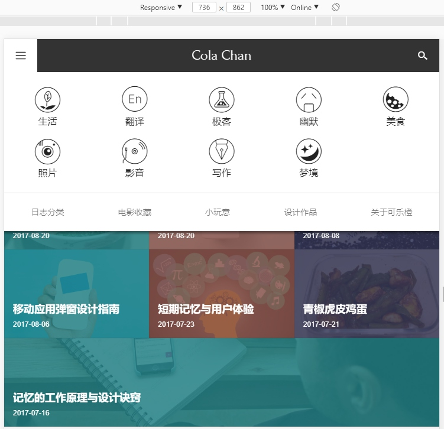
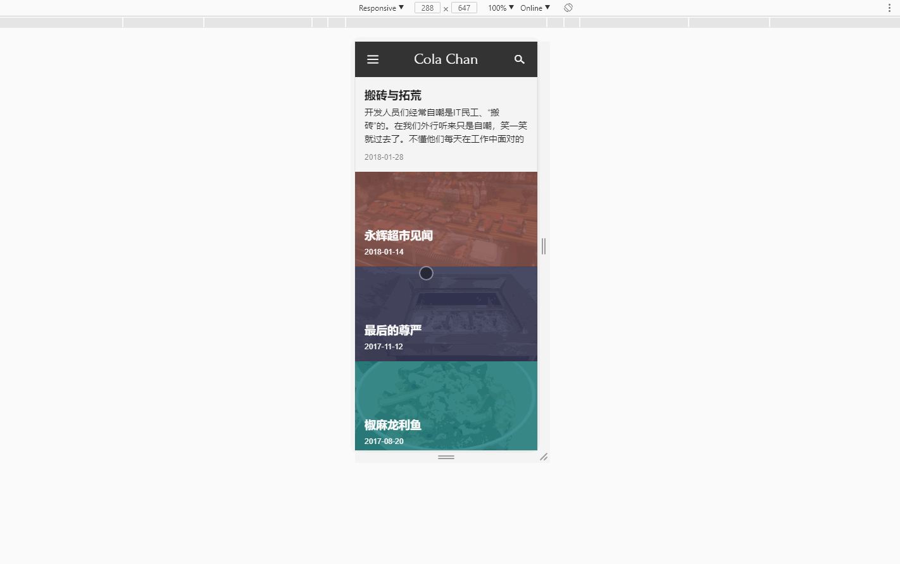
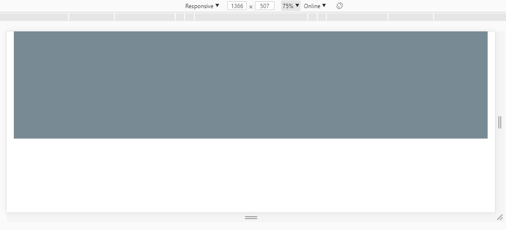
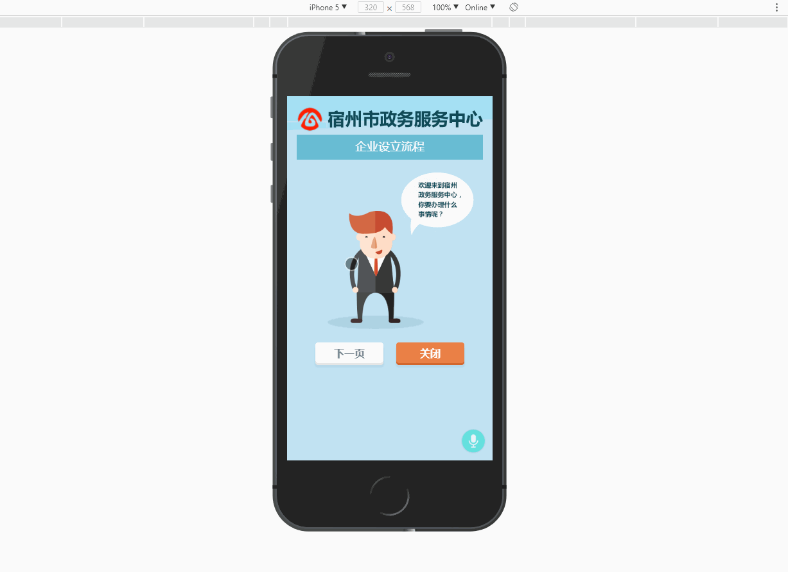

---
tags:
  - 'abc'
---

# 响应式网页是什么

前一段时间，我们团队的PC小组遇到了好几次这样的情况：开发成果已经交付，然后收到要求说要将网页改成响应式的。好，响应式可以改。可还说非要用 `Bootstrap`。 

类似的现象并不少见，为了减少公司内部部门员工之间的沟通成本，并减少彼此之间的误会，特整理了一些关于响应式网页设计的一些知识，以便都对此有所了解。

那么什么是响应式网页呢？

知乎问答上有这样一段描述，个人感觉比较贴切：

> 伊桑·马科特（Ethan Marcotte）在2010年首先提出了响应式网页设计（RWD,Responsive Web Design）这个术语。在他的一篇文章[《Responsive Web Design · An A List Apart Article》](http://alistapart.com/article/responsive-web-design) 中他将已有的三种发开技巧（弹性图片，弹性网格布局，媒体与媒体查询） 进行了整合，命名为响应式网页设计。
> 那什么才是真正的响应式设计？马科特说，真正的响应式设计方法**不仅仅是根据可视区域大小而改变网页布局，而是要从整体上颠覆当前网页的设计方法**，是针对**任意设备**的网页内容进行**完美布局**的一种显示机制。

可以看出两个特性：

1. 不仅仅是根据浏览器大小调整布局
2. 任意设备下都是完美布局

上面还提到了一个说法“根据可视区域大小而改变网页的布局”，这种被称为“自适应布局”，关于自适应布局有两种说法：

一种狭义是自适应布局说法是这样的：自适应布局是为了解决“如何才能在不同大小的设备上呈现同样的网页”， 实现原理主要是依据于允许网页宽度自动调整(比如Viewport标签中的width=device-width,会默认将网页初始化大小占满屏幕) 这种布局一般会使用相对大小(如em,rem,百分比等)，一般会尽力避免使用绝对大小(px)， 这样就达到了随着屏幕大小的不断变化，内容不会溢出，而是自适应的挤压或变长的效果。

这种自适应布局的实现可以完全不依赖于媒体查询(Media Query)，比如要实现一个内容区域始终距离左右两侧20px的居中布局，就可以直接设置外层容器的左右 `padding`，内部直接放置块级元素即可，这样就可以做到在任何设备下都是左右留白 `20px` ， 自适应布局是做到的了。但是这种体验真的就好了吗？且听后文分解。

另一种自适应布局则是广泛的指网页具有自适应性，不仅仅是指布局，还包括内容、展示交互等，这就是一个非常广泛的概念了，这种情况下，响应式布局只是自适应性的一个子集。

那么响应式的网页应该是什么效果呢？

我以一个博客网站给大家做下演示：

手机屏幕下：

平板大小的屏幕下：

pc大小的屏幕下：

动图放大如下：

请忽略它在768px~1200px之间头部颜色看不清的bug。

从以上的对比中不难发现一些现象：

1. 不同屏幕大小下展示内容的形式不一样
  - 手机和平板大小的屏幕下导航是默认收起的，点击才会展示
  - 不同大小屏幕下，首屏展示不同：PC下仅展示了导航和图片，而小屏幕下都是直接展示了文章列表
  -  文章列表的展示形式不同
2. 不同屏幕大小下展示的内容不同
  - 导航内容不同
  - 首屏内容不同
  - 文章展示内容不同
3. 交互形式有所不同

其实以上展示的这个网站基本就是符合响应式网页的要求的，不仅仅是适应设备的大小，还要在不同的设备上均体现出完美布局。

为什么响应式一定要强调一个不同设备下均要完美布局呢？

现在解释一下上面那个全部设备下左右均留白20px为什么体验不好的问题。

.

其实已经看出一些端倪：

- 手机屏幕下，本来屏幕就小，再各留20px，显得浪费空间
- 900下效果尚可
- 1366下，已经感觉内容区域过宽，横向阅读费力
- 1920以及更高的分辨率下横向阅读费力的情况将更加明显

所以仅仅在不同设备上显示相同的布局，保证不错乱是远远不够的，要想比较好的体验，就必须针对不同的屏幕进行不同的布局，而且所展示的内容也应该有所不同。

针对PC设备来说，屏幕相对较大，可以展示出比较多的内容。而对于手机或者平板等设备来说，屏幕就小的多了，必须要在有限大小的屏幕上直接展示出最直接、最关键的内容。

同时，手机平板等设备通常是没有鼠标这样的设备的，基本都是靠手指触摸操作，因此对于可点击的按钮需要进行优化处理，要足够大，方便用户手指进行点击，同时还可以避免误点击。

除了上面说到的布局和内容之外，响应式网页还需要在不同的设备下展示不同的图片。

手机平板设备加载在PC上展示的图片，由于图片尺寸和体积大，可能导致加载缓慢，影响体验。而PC上加载小图片，则会存在图片被拉伸放大，显示模糊的问题。

再展示一下本文最开始所描述问题的最终成果：

 

这就是应客户需求，要响应式，而且要用bootstrap的一个成果物，其实针对以上展示的情景，套用bootstrap并非是一个好的选择，但是毕竟客户至上，这里就忽略吧。

以上就基本具备了响应式网页应有的特点

- 不同设备下不同布局
- 不同设备下展示不同内容
- 不同设备下不同交互
- 不同设备下加载不同大小的图片
